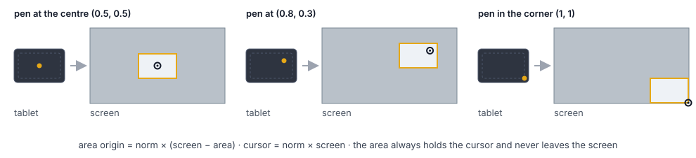
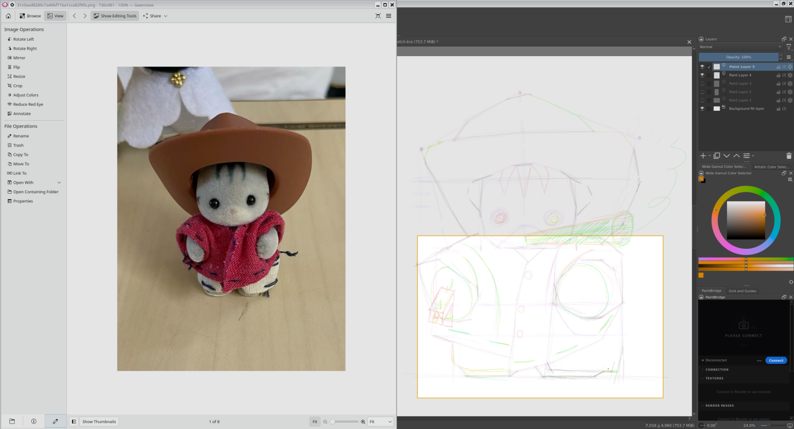
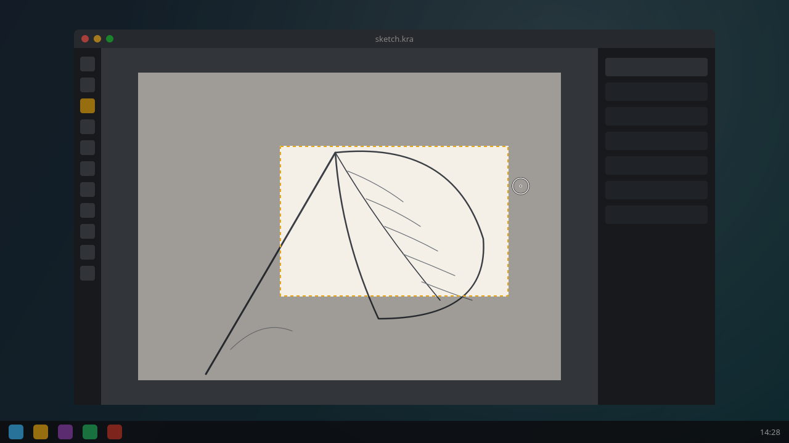
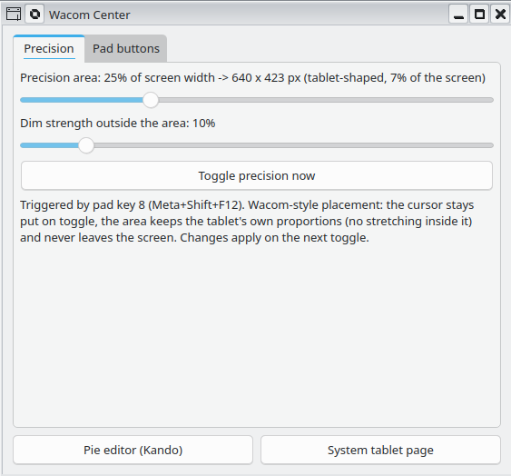
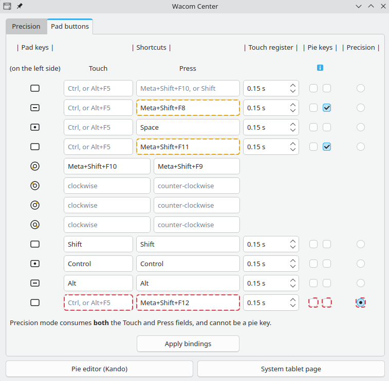

# plasma-wacom-center

Wacom-style **precision mode** for drawing tablets on KDE Plasma 6 (Wayland),
a pie menu that opens under the pen, and a small settings window. Wacom ships
no Linux driver, and Plasma's Drawing Tablet page covers mapping, pressure,
and buttons - but not precision mode. This project fills that gap with plain
scripts on top of KWin's own D-Bus interfaces. No compiled code, no kernel
modules, one optional small daemon (the touch preview).

Built and tested on Kubuntu 26.04, Plasma 6.6, with a Bluetooth Wacom Intuos
Pro M. Any tablet that Plasma's Drawing Tablet page recognizes should work -
devices are found by capability, not by model name.

## What it does

- **Precision mode toggle** (a pad button, or Meta+Shift+F12): the pen maps
  to a small rectangle around the cursor instead of the whole screen, for
  detail work. Press again to go back.
- **The cursor does not move on toggle.** The rectangle is placed with the
  rule Wacom's Windows driver uses: `rect = norm * (screen - rect)`, where
  `norm` is the pen's normalized tablet position. Near a screen border the
  area drifts slower than the cursor and can never leave the screen.
- **No stretch inside the area.** The rectangle keeps the tablet's own
  aspect ratio (read from the hardware), so your input is not distorted.
- **Dim overlay.** Everything outside the mapped area dims; the work area
  stays clear with a thin border. Click-through, on the compositor overlay
  layer. Can be adjusted in settings. Every preview the toolkit shows (the
  ring preview, the touch-preview ghost, the area while it is dragged) is
  the same picture with the border dashed and flowing clockwise: a
  rectangle waiting to be activated.
- **Ring size control.** The tablet's touch ring resizes the area in 2%
  steps (5-80% of screen width). With precision mode off, a centred fading
  preview shows the prospective size; with it on, the area itself grows or
  shrinks around its centre and stays where it is. Ticks while the area is
  being dragged are ignored.
- **Wacom Center**, a PyQt window: size and dim sliders, the hold time, express-key chord
  editor, buttons to the pie-menu editor and the system tablet page.
- **Pie menu under the pen.** `tablet-pie.sh` moves the mouse onto the pen
  and then opens a [Kando](https://kando.menu) menu, so the pie appears where
  you draw, not where the mouse was left.
- **ExpressKey touch preview** (experimental). While a finger rests on the
  precision key, a ghost - precision mode's own picture with the flowing
  border - shows where the area would go; with precision mode on, holding
  the key drags the area to a new place. See below.

<p align="center"></p>

The placement rule in three cases. The area follows the pen, always holds
the cursor, and stops at the screen edge.

## In pictures

https://github.com/user-attachments/assets/5c04b1b3-ea14-4669-b458-18271664d768

<p align="center"></p>

Precision mode on, with the reference in Gwenview and the drawing in Krita.
The pen now maps to the rectangle with the amber border; the rest of the
screen is dimmed (10% here). The cursor did not move when the mode came on.

<p align="center"></p>

A tick of the touch ring with precision mode off. The preview is the mode's
own picture, centred, with the dashed border every preview wears; it fades
out by itself. With the mode on, the area itself resizes around its centre
and nothing else shows.

<p align="center"> </p>

Wacom Center: the size and dim sliders, and the chord editor for the
express keys.

The ring preview picture is a drawing; `docs/make-images.py` renders it
with the same geometry the scripts use. The other pictures are screenshots.

## Requirements

Everything below ships with a stock Kubuntu / KDE Plasma 6.5+ install except
PyQt6:

- Plasma 6.5 or newer on Wayland (6.6 tested). X11 sessions: use `xsetwacom`
  instead, this project is Wayland-only.
- `python3-pyqt6` and `python3-pyqt6.qtquick` (overlay and settings window)
- `qml6-module-org-kde-layershell` and `qml6-module-qtquick-shapes` (both
  dependencies of the Plasma desktop, so present)

```
sudo apt install python3-pyqt6 python3-pyqt6.qtquick
```

## Install

```
git clone https://github.com/lugi-ow/plasma-wacom-center
cd plasma-wacom-center
./install.sh
```

The installer copies the scripts to `~/.local/bin`, creates and registers
four global shortcuts (Meta+Shift+F12 toggle, F11 pie, F10/F9 size), adds
an autostart entry for the touch preview, and offers to bind your tablet's
ring. It then prints the manual steps:

1. One sudo udev rule so the scripts can read the pen's position and, on
   Wacom tablets, the express keys' touch sense. Without it, precision
   mode centres on the mouse cursor instead of the pen.
2. Binding pad buttons to Meta+Shift+F12 (toggle) and Meta+Shift+F11 (pie)
   in System Settings -> Drawing Tablet.

If the shortcuts do not fire immediately, log out and back in once.

## Known limitations

- Single monitor. The placement math uses the virtual screen; with two
  outputs it will misplace the area. Patches welcome.
- Display scale other than 100% is untested. The overlay takes pixel
  positions from the X screen and draws in Qt's logical pixels. At 100%
  both are the same space.
- The base mapping is assumed to be the default full-tablet stretch. A
  letterboxed mapping set on the Display page is restored correctly on
  toggle-off, but the cursor-stationary placement will drift.
- Right after a Bluetooth reconnect, before the pen first touches the
  tablet, the kernel reports position 0,0 and a toggle lands the area
  top-left. Hover the pen once first.
- The touch preview needs keys with a touch sensor (Wacom Intuos Pro,
  Cintiq Pro, MobileStudio Pro). Layouts are built in for the Intuos Pro
  2017 family; the M size is measured, S and L are expected to match.
- Stylus click-to-focus between windows is broken upstream in Plasma 6.6
  (KDE bug 498386 and friends) - not something this project can fix.

## Pie menus

Plasma has no on-screen pie menus; [Kando](https://kando.menu) fills that
role well on Plasma Wayland and sends physical key codes (layout-proof).
`examples/kando-krita-menu.json` is a working Krita pie: selection tools,
transform, brush, canvas rotation reset.

Symptom without this script: the pie opens where the mouse was last left,
not under the pen, because Kando asks the compositor for the pointer and
gets the mouse. Open it with `tablet-pie.sh Krita` instead - install.sh
binds Meta+Shift+F11 to it. The script reads the pen position, warps the mouse there
(`tablet-pointer-warp.py`) and then runs `kando --menu "Krita"`, so the pie
opens under the pen. Without a pen position (tablet asleep, no udev rule)
it runs `kando --menu` as before, at the mouse. The menu name is the first
argument. It needs write access to `/dev/uinput`. Kubuntu grants it to the
logged-in user. Elsewhere add a udev rule: `KERNEL=="uinput", TAG+="uaccess"`.

## ExpressKey touch preview (experimental)

The Intuos Pro's express keys sense a finger that rests on them before the
press. `tablet-hover.py` uses that to show a ghost of the area precision
mode would map right now - same placement math, nothing changed - and
moves it with the pen, and removes it when the finger lifts or the key is
pressed. The ghost is precision mode's own picture, the same dim and the
same border, with the border dashed and flowing clockwise: the sign of a
preview waiting to be activated. On a Wacom Intuos Pro (2017 or later) there is nothing to set
up beyond the udev rule from the install step: the report layouts are
built into `tablet-hover.py`, and the daemon learns which key is the
precision key the first time a single key press is followed by
precision mode switching on or off. It saves that key to
`~/.config/tabprec.conf` as `HOVER_MASK`. Only keys with a touch sensor
can do this (Intuos Pro, Cintiq Pro, MobileStudio Pro); on other tablets
the daemon idles. For a Wacom model it does not know, one run of
`tablet-pad-probe.py` per connection type shows the bytes that carry the
touch and press bits, which go into the conf as `HOVER_REPORT_USB`,
`HOVER_BYTE_USB`, `PRESS_BYTE_USB` and the same with `_BT`; the two
buses use different layouts. Reference, Intuos Pro M, one bit per key,
key N = bit N-1 (key 8 = `0x80`): over USB report `0x11`, byte 2 =
touch bits, byte 1 = press bits; over Bluetooth report `0x80`, byte 283 =
touch bits, byte 282 = press bits.

With precision mode already on, the same key relocates the area. Rest a
finger on it (the hold time field in Wacom Center, `HOLD` in
`~/.config/tabprec.conf`, default 0.6 s, picked up without a restart): the
pen gets the whole screen back for the moment, the cursor roams, and the
real overlay travels around it with the same placement rule, wearing the
flowing border until the press. Press the key to map the area there,
around the cursor. Lift the finger without a press and both the overlay
and the mapping return to the old area. A quick press still switches the
mode off; ring ticks during the drag are ignored. Under the hood the
overlay is moved through a named pipe (`tablet-overlay.py --fifo`, the
lines `waiting` and `solid` switch its border), the ring resize uses the
same pipe instead of respawning the overlay, the toggle script's `suspend`
and `resume` modes bracket the drag, and a marker file that the daemon
keeps fresh tells the toggle that the press is a move.

## For contributors and AI agents

`PROJECT_MAP.md` says what each file is for, how the processes talk to each
other (the runtime files, the conf keys, the overlay's pipe) and lists every
chunk marker (`# ── chunk: <name>`), so you can grep instead of read.
`tests/run_all.sh` runs every gate in about 25 s without a tablet: compile,
shell syntax, the map check, and two rigs that drive the toggle script and the
hover daemon with fakes.

## License

MIT. Built with Claude Code.

---

[The knowledge (why these scripts look the way they do)](KNOWLEDGE.md) - the facts behind these scripts, each of which cost a debugging session.
